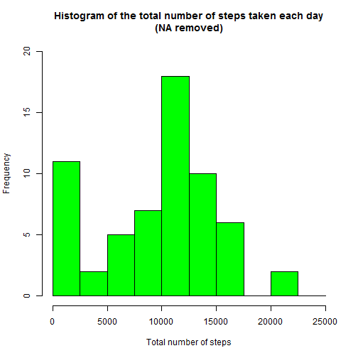
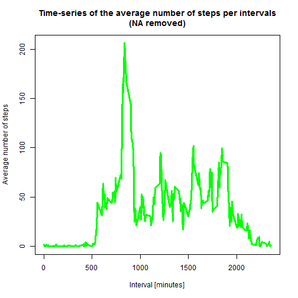
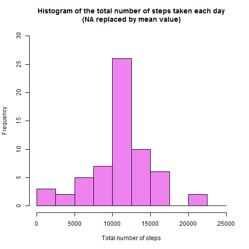
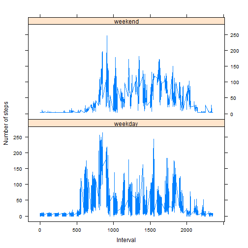

Github repository with R Markdown source code present in: https://github.com/PARAMA34/RepData_PeerAssessment1

## Introduction

This assignment makes use of data from a personal activity monitoring device. This device collects data at 5 minute intervals through out the day. The data consists of two months of data from an anonymous individual collected during the months of October and November, 2012 and include the number of steps taken in 5 minute intervals each day.

This document presents the results of the Reproducible Research's Peer Assessment 1 in a report using a single R markdown document that can be processed by knitr and be transformed into an HTML file.

Through this report you can see that activities on weekdays mostly follow a work related routine, where we find some more intensity activity in little a free time that the employ can made some sport.

## Prepare the R environment

First, we set echo equal a TRUE and results equal a 'hold' as global options for this document.


```r
library(knitr)
opts_chunk$set(echo = TRUE, results = "hold", fig.height=7, fig.width=7, fig.align='center')
```
## Load required libraries


```r
library(data.table)
library(ggplot2) # we shall use ggplot2 for plotting figures
```

## Loading and preprocessing the data

#### 1. Load the data (i.e. read.csv())

We assume that the reader set the correct R working directory with the setwd() function.


```r
# Set working directory
setwd("C:/Parama/coursera/Rep_Research/Week2/PA_1")

# Clear the workspace
rm(list=ls())

# Load the raw activity data
activity_raw <- read.csv("activity.csv", stringsAsFactors=FALSE)
```

#### 2. Process/transform the data (if necessary) into a format suitable for your analysis


```r
# Transform the date attribute to an actual date format
activity_raw$date <- as.POSIXct(activity_raw$date, format="%Y-%m-%d")

# Compute the weekdays from the date attribute
activity_raw <- data.frame(date=activity_raw$date, 
                           weekday=tolower(weekdays(activity_raw$date)), 
                           steps=activity_raw$steps, 
                           interval=activity_raw$interval)

# Compute the day type (weekend or weekday)
activity_raw <- cbind(activity_raw, 
                      daytype=ifelse(activity_raw$weekday == "saturday" | 
                                     activity_raw$weekday == "sunday", "weekend", 
                                     "weekday"))

# Create the final data.frame
activity <- data.frame(date=activity_raw$date, 
                       weekday=activity_raw$weekday, 
                       daytype=activity_raw$daytype, 
                       interval=activity_raw$interval,
                       steps=activity_raw$steps)

# Clear the workspace
rm(activity_raw)

# Check the data using str() method
str(activity)
```

```
## 'data.frame':	17568 obs. of  5 variables:
##  $ date    : POSIXct, format: "2012-10-01" "2012-10-01" ...
##  $ weekday : Factor w/ 7 levels "friday","monday",..: 2 2 2 2 2 2 2 2 2 2 ...
##  $ daytype : Factor w/ 2 levels "weekday","weekend": 1 1 1 1 1 1 1 1 1 1 ...
##  $ interval: int  0 5 10 15 20 25 30 35 40 45 ...
##  $ steps   : int  NA NA NA NA NA NA NA NA NA NA ...
```

Lets have a look at the first few records from the formatted dataframe

```r
# See the first 6 records from the activity dataframe
head(activity)
```

```
##         date weekday daytype interval steps
## 1 2012-10-01  monday weekday        0    NA
## 2 2012-10-01  monday weekday        5    NA
## 3 2012-10-01  monday weekday       10    NA
## 4 2012-10-01  monday weekday       15    NA
## 5 2012-10-01  monday weekday       20    NA
## 6 2012-10-01  monday weekday       25    NA
```

Lets have a look at the last few records from the formatted dataframe

```r
# See the last 6 records from the activity dataframe
tail(activity)
```

```
##             date weekday daytype interval steps
## 17563 2012-11-30  friday weekday     2330    NA
## 17564 2012-11-30  friday weekday     2335    NA
## 17565 2012-11-30  friday weekday     2340    NA
## 17566 2012-11-30  friday weekday     2345    NA
## 17567 2012-11-30  friday weekday     2350    NA
## 17568 2012-11-30  friday weekday     2355    NA
```
## What is the mean total number of steps taken per day?
For this part of the assignment, we can ignore the missing values in the dataset.

#### 1. Calculate the total number of steps taken per day


```r
# Compute the total number of steps each day (NA values removed)
sum_data <- aggregate(activity$steps, by=list(activity$date), FUN=sum, na.rm=TRUE)

# Rename the attributes
names(sum_data) <- c("date", "total")
```

Lets have a look at the first few records from the formatted dataframe

```r
# See the first 6 records from the sum_data dataframe
head(sum_data)
```

```
##         date total
## 1 2012-10-01     0
## 2 2012-10-02   126
## 3 2012-10-03 11352
## 4 2012-10-04 12116
## 5 2012-10-05 13294
## 6 2012-10-06 15420
```

Lets have a look at the last few records from the formatted dataframe

```r
# See the last 6 records from the sum_data dataframe
tail(sum_data)
```

```
##          date total
## 56 2012-11-25 11834
## 57 2012-11-26 11162
## 58 2012-11-27 13646
## 59 2012-11-28 10183
## 60 2012-11-29  7047
## 61 2012-11-30     0
```

#### 2. Make a histogram of the total number of steps taken each day

The histogram is given by the following lines of code



#### 3. Calculate and report the mean and median total number of steps taken per day
The mean and median are computed like

```r
stepsMean <- mean(sum_data$total)
stepsMedian <- median(sum_data$total)
```

The mean number of steps was **9354.2295082** per day.
The median number of steps was **10395** per day.

## What is the average daily activity pattern?

For this part of the assignment, we can ignore the missing values in the dataset.

#### 1. Make a time series plot (i.e. type = "l") of the 5-minute interval (x-axis) and the average number of steps taken, averaged across all days (y-axis)


```r
# Clear the workspace
rm(sum_data)

# Compute the means of steps accross all days for each interval
mean_data <- aggregate(activity$steps, 
                       by=list(activity$interval), 
                       FUN=mean, 
                       na.rm=TRUE)

# Rename the attributes
names(mean_data) <- c("interval", "mean")
```

Lets have a look at the first few rows of the formatted data frame:

```r
# See the first 6 records from the mean_data dataframe
head(mean_data)
```

```
##   interval      mean
## 1        0 1.7169811
## 2        5 0.3396226
## 3       10 0.1320755
## 4       15 0.1509434
## 5       20 0.0754717
## 6       25 2.0943396
```

Lets have a look at the last few rows of the formatted data frame:

```r
# See the last 6 records from the mean_data dataframe
tail(mean_data)
```

```
##     interval      mean
## 283     2330 2.6037736
## 284     2335 4.6981132
## 285     2340 3.3018868
## 286     2345 0.6415094
## 287     2350 0.2264151
## 288     2355 1.0754717
```

The time series plot is created by the following lines of code

```r
# Compute the time series plot
plot(mean_data$interval, 
     mean_data$mean, 
     type="l", 
     col="green", 
     lwd=3, 
     xlab="Interval [minutes]", 
     ylab="Average number of steps", 
     main="Time-series of the average number of steps per intervals\n(NA removed)")
```



#### 2. Which 5-minute interval, on average across all the days in the dataset, contains the maximum number of steps?


```r
# Find the position of the maximum mean
max_pos <- which(mean_data$mean == max(mean_data$mean))

# Lookup the value of interval at this position
max_interval <- mean_data[max_pos, 1]

# Clear the workspace
rm(max_pos, mean_data)
```

The 5-minute interval that contains the maximum of steps, on average across all days, is **835**.

## Imputing the missing values
Note that there are a number of days/intervals where there are missing values (coded as NA). The presence of missing days may introduce bias into some calculations or summaries of the data.

#### 1. Calculate and report the total number of missing values in the dataset (i.e. the total number of rows with NA's)


```r
# Clear the workspace
rm(max_interval)

# Lets assume that a TRUE boolean value is equivalent to 1 and a FALSE to 0.
NA_count <- sum(is.na(activity$steps))
```

The number of NA's is **2304**.

#### 2. Devise a strategy for filling in all of the missing values in the dataset. The strategy does not need to be sophisticated. For example, you could use the mean/median for that day, or the mean for that 5-minute interval, etc.


```r
# Clear the workspace
rm(NA_count)

# Find the NA positions
NA_pos <- which(is.na(activity$steps))

# Create a vector of means
mean_vec <- rep(mean(activity$steps, na.rm=TRUE), times=length(NA_pos))
```
We have replaced each NA value by the mean of the steps attribute.

#### 3. Create a new dataset that is equal to the original dataset but with the missing data filled in.


```r
# Replace the NAs by the means
activity[NA_pos, "steps"] <- mean_vec

# Clear the workspace
rm(mean_vec, NA_pos)
```

Lets have a look at the first few rows of the formatted data frame:

```r
# See the first 6 records from the activity dataframe
head(activity)
```

```
##         date weekday daytype interval   steps
## 1 2012-10-01  monday weekday        0 37.3826
## 2 2012-10-01  monday weekday        5 37.3826
## 3 2012-10-01  monday weekday       10 37.3826
## 4 2012-10-01  monday weekday       15 37.3826
## 5 2012-10-01  monday weekday       20 37.3826
## 6 2012-10-01  monday weekday       25 37.3826
```

Lets have a look at the last few rows of the formatted data frame:

```r
# See the last 6 records from the activity dataframe
tail(activity)
```

```
##             date weekday daytype interval   steps
## 17563 2012-11-30  friday weekday     2330 37.3826
## 17564 2012-11-30  friday weekday     2335 37.3826
## 17565 2012-11-30  friday weekday     2340 37.3826
## 17566 2012-11-30  friday weekday     2345 37.3826
## 17567 2012-11-30  friday weekday     2350 37.3826
## 17568 2012-11-30  friday weekday     2355 37.3826
```

#### 4. Make a histogram of the total number of steps taken each day and calculate and report the mean and median total number of steps taken per day. Do these values differ from the estimates from the first part of the assignment? What is the impact of imputing missing data on the estimates of the total daily number of steps?


```r
# Compute the total number of steps each day (NA values removed)
sum_data <- aggregate(activity$steps, by=list(activity$date), FUN=sum)

# Rename the attributes
names(sum_data) <- c("date", "total")
```


```r
# Compute the histogram of the total number of steps each day
hist(sum_data$total, 
     breaks=seq(from=0, to=25000, by=2500),
     col="violet", 
     xlab="Total number of steps", 
     ylim=c(0, 30), 
     main="Histogram of the total number of steps taken each day\n(NA replaced by mean value)")
```



The mean and median are computed like


```r
stepsMean2 <- mean(sum_data$total)
stepsMedian2 <- median(sum_data$total)
```

The mean number of steps was **1.0766189 &times; 10<sup>4</sup>** per day.
The median number of steps was **1.0766189 &times; 10<sup>4</sup>** per day.

These values differ greatly from the estimates from the first part of the assignment. The impact of imputing the missing values is to have more data, hence to obtain a bigger mean and median value.

## Are there differences in activity patterns between weekdays and weekends?

For this part the weekdays() function may be of some help here. Use the dataset with the filled-in missing values for this part.

#### 1. Create a new factor variable in the dataset with two levels - "weekdays" and "weekend" indicating whether a given date is a weekday or weekend day.


```r
# The new factor variable "daytype" containing the 2 levels weekdays and weekend has been introduced at the beginning in the activity data frame
head(activity)
```

```
##         date weekday daytype interval   steps
## 1 2012-10-01  monday weekday        0 37.3826
## 2 2012-10-01  monday weekday        5 37.3826
## 3 2012-10-01  monday weekday       10 37.3826
## 4 2012-10-01  monday weekday       15 37.3826
## 5 2012-10-01  monday weekday       20 37.3826
## 6 2012-10-01  monday weekday       25 37.3826
```

#### 2. Make a panel plot containing a time series plot (i.e. type = "l") of the 5- minute interval (x-axis) and the average number of steps taken, averaged across all weekday days or weekend days (y-axis).


```r
# Clear the workspace
rm(sum_data)

# Load the lattice graphical library
library(lattice)

# Compute the average number of steps taken, averaged across all daytype variable
mean_data <- aggregate(activity$steps, 
                       by=list(activity$daytype, 
                               activity$weekday, activity$interval), mean)

# Rename the attributes
names(mean_data) <- c("daytype", "weekday", "interval", "mean")
```

Lets have a look at the first few rows of the formatted data frame:

```r
# See the first 6 records from the mean_data dataframe
head(mean_data)
```

```
##   daytype  weekday interval     mean
## 1 weekday   friday        0 8.307244
## 2 weekday   monday        0 9.418355
## 3 weekend saturday        0 4.672825
## 4 weekend   sunday        0 4.672825
## 5 weekday thursday        0 9.375844
## 6 weekday  tuesday        0 0.000000
```

Lets have a look at the last few rows of the formatted data frame:

```r
# See the last 6 records from the mean_data dataframe
tail(mean_data)
```

```
##      daytype   weekday interval     mean
## 2011 weekday    monday     2355 8.307244
## 2012 weekend  saturday     2355 4.672825
## 2013 weekend    sunday     2355 4.672825
## 2014 weekday  thursday     2355 4.153622
## 2015 weekday   tuesday     2355 2.222222
## 2016 weekday wednesday     2355 7.375844
```

The time series plot take the following form


```r
# Compute the time series plot
xyplot(mean ~ interval | daytype, mean_data,
       type="l", 
       lwd=1, 
       xlab="Interval", 
       ylab="Number of steps", 
       layout=c(1,2))
```


